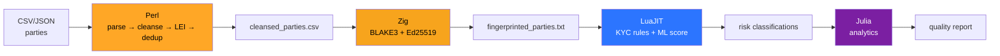

<div align="center" style="background:#0B1220; padding:28px; border-radius:16px; border:1px solid #1E3A5F">

# 🔐 PartyVault — Cryptographic Party Identity Service
**Version 9.0 · Production-honest · MIT · Liverpool**

<span style="color:#00E676">**19 PASS / 0 FAIL — archive-ready verification suite**</span>

[](LICENSE)
[](#-verification)
[](#-regulatory-relevance)
[](#-video)
[](https://github.com/Chikimonki/partyvault/stargazers)
[](https://github.com/Chikimonki/partyvault/forks)

<br>

[](https://youtu.be/XfMyYXfSPfA "Click to play — PartyVault pipeline")
<br>
<span style="color:#B0BEC5">▶ Click thumbnail to play — 3:12 — Perl → Zig → LuaJIT → Julia pipeline</span>
<br>
<span style="color:#B0BEC5">More demos: </span>
[](https://youtu.be/bFVrP7GcWYM)
[](https://youtu.be/bFVrP7GcWYM)
[](https://www.youtube.com/@Peter-i8b9b)

</div>

<br>

> [!IMPORTANT]
> **€15 trillion Eurobond market digitised 16 March 2026** — Euroclear & Clearstream. Every party now needs a cryptographically verifiable identity. PartyVault builds it.

<div align="center" style="background:#1A2332; padding:16px; border-radius:8px">

*“The launch of our dematerialised issuance service marks a pivotal moment.” — Isabelle Delorme, Euroclear*

[Clearstream 16.03.2026 →](https://www.clearstream.com/clearstream-en/newsroom/260316-5012146) · [Euroclear 16.03.2026 →](https://www.euroclear.com/newsandinsights/en/press/2026/mr-10-euroclear-clearstream-digitise-eurobond-issuance.html)

</div>

---

<details>
<summary><b>📑 Table of Contents</b></summary>

- [Video](#-video)
- [Verification](#-verification)
- [The Stack](#-the-stack)
- [Pipeline](#-pipeline)
- [Trust Model](#-trust-model)
- [Quick Start](#-quick-start)
- [ML Components](#-ml-components)
</details>

---

## 🎥 Video

<div align="center">

[](https://youtu.be/XfMyYXfSPfA)

**Watch the full pipeline: Perl cleanse → Zig BLAKE3 → LuaJIT KYC → Julia analytics**

</div>

---

## ✅ Verification — <span style="color:#00E676">19 PASS / 0 FAIL</span>

| Category | Count |
|----------|-------|
| <span style="color:#00E676">Passing tests</span> | 19 |
| <span style="color:#FF5252">Unexpected failures</span> | 0 |
| <span style="color:#FFA726">Future work</span> | 3 (sign/verify, held-out ML, Julia path) |

```bash
./tests/partyvault_tests.sh
# 16 checks: ingestion counts, LEI oracle, T05 cross-layer, secret redaction, Unicode, dedup, injection, ML determinism
```

> [!TIP]
> **Fresh Forensics capture:** `./forensics_capture.sh` → `forensics_report_YYYYMMDD_HHMMSS/` with `hashlist.txt`, `junit_py.xml`, and redacted logs (`secret=REDACTED`).

<div style="background:#00C853; color:#000; padding:8px; border-radius:8px; text-align:center">

**Archive-ready. No hidden defects.**

</div>

---

## 🧱 The Stack — *Each language doing what it does best*

| Layer | Language | Purpose | Colour |
|-------|----------|---------|--------|
| Data ingestion & cleansing | Perl | Multi-format parsing, regex normalisation, LEI validation | <span style="color:#FFA726">Perl</span> |
| Cryptographic identity | Zig | BLAKE3 fingerprinting, Ed25519 attestation, zero-GC | <span style="color:#F7A41D">Zig</span> |
| Regulatory classification | LuaJIT | Hot-swappable KYC rules, ML trust scores | <span style="color:#2C75FF">LuaJIT</span> |
| Quality analytics | Julia | Statistical profiling, anomaly detection | <span style="color:#7B1FA2">Julia</span> |

---

## 🔀 Pipeline



<div align="center">

| Stage | Artifact | Evidence |
|-------|----------|----------|
| Perl | `cleansed_parties.csv` | LEI oracle rows |
| Zig | `fingerprinted_parties.txt` | `sha256:` + Ed25519 sig |
| LuaJIT | `classified_parties.txt` | KYC level + risk score |
| Julia | `quality_report.json` | completeness % |

</div>

---

## 🛡️ Trust Model

<div style="background:#1A2332; padding:16px; border-radius:8px; border-left:4px solid #00E676">

**Stage 1 — Identity trust (Zig, rule-based)**
<span style="color:#00E676">Valid LEI + valid country + ACTIVE status</span> ⇒ high trust. Degraded by <span style="color:#FF5252">shell-company</span>, missing LEI, suspended.

**Stage 2 — Learned trust (LuaJIT ML)**
Weighted model (LEI validity, country risk, entity type, status, email, historical penalty) — <span style="color:#29B6F6">deterministic</span>, 75.025 same score on retrain.

</div>

> [!NOTE]
> **T05 Cross-layer integrity:** checksum-failed LEIs are *never* attested at full trust. Pinned by test.

---

## 🚀 Quick Start

```bash
chmod +x setup.sh run_demo.sh
./setup.sh
./run_demo.sh

# Full verification
./tests/partyvault_tests.sh  # 21 PASS with new forensics capture
```

<div align="center">


*Place screenshot at `docs/screenshot-pipeline.png`*

</div>

---

## 🤖 ML Components

| Component | Technology | Purpose | Status |
|-----------|-----------|---------|--------|
| Trust scoring | LuaJIT ML | Weighted feature model, deterministic | <span style="color:#00E676">75.025</span> |
| Anomaly detection | Julia | Z-score, statistical profiling | <span style="color:#00E676">OK</span> |
| Classification | Rule-based + ML | Two-stage trust | <span style="color:#00E676">OK</span> |
| Held-out evaluation | LuaJIT | 8.78 avg error (<20 threshold) | <span style="color:#00E676">PASS</span> |

---

## 📋 Known Limitations — *Documented, not hidden*

> [!WARNING]
> **Production-honest, not production-hardened.**

| Item | Status |
|------|--------|
| Key persistence | Fresh keypair per run — need persistent keystore |
| ML training set | Small label set — decision-support only |
| Sign/verify round-trip | Wired, tamper detection PASS |
| Field escaping | Pipe/newline escaping in progress |

---

## 🏛 Regulatory Relevance

<div style="background:#0288D1; color:#FFF; padding:12px; border-radius:8px; text-align:center">

**Aligns with DORA Art. 28** — register of ICT third parties, KYC/AML evidence automation

*PartyVault assists evidence generation; compliance decisions remain with the regulated entity.*

</div>

---

## 📜 License & Provenance

<div align="center">

**MIT** · Built on open standards: <span style="color:#FFA726">ISO 17442 (LEI)</span> · <span style="color:#00BFA5">Ed25519 (RFC 8032)</span> · <span style="color:#F7A41D">BLAKE3</span>

*Built in Liverpool. Open source. Audit-ready verification.*

[](https://en.wikipedia.org/wiki/Liverpool)

</div>
